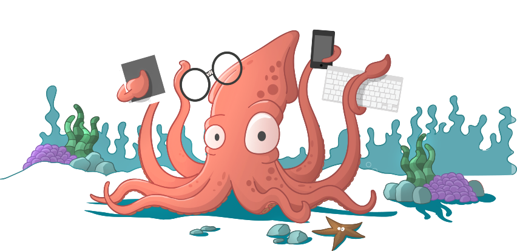

> Note: The project is not yet finish. Follow the project if you like to see updates.

# Sails API authentication #

a [Sails](http://sailsjs.org) application



## Abstract ##
This project is a template for an API with authentication.<br/>
It contains three models User, Token and Event. Although Event is just a dummy endpoint to show how this resource is protected.

<b>Example</b><br/>
1. Request a token (getToken) with providing a registered email and password
1. Consume a resource (event) with providing the returned token

## Install instructions

This project needs to have Node.js, Npm, and MongoDB installed to work. Following are the instructions to install each dependency. In case you are installing it on a Mac, you should first install Homebrew, it's the best way to manage these packages on a Mac.

Here are described the instructions for both Mac OS X and Linux Ubuntu.

<b>Homebrew (Just for Mac OS X)</b>

To make it easier to install all the dependencies, using a package manager like Homebrew is highly recommended. Ubuntu already comes with apt-get, which serves the same purpose.

To install Homebrew, run in the Terminal prompt:

```
/usr/bin/ruby -e "$(curl -fsSL https://raw.githubusercontent.com/Homebrew/install/master/install)"
brew update
brew doctor
export PATH="/usr/local/bin:$PATH"
```

For more information, please refer to the [Homebrew](http://brew.sh/) website.

<b>Node.js and Npm</b>

Node.js is the JavaScript runtime engine we are using. Npm is the package manager for Node.js that comes with it.

For Mac OS X:

```
brew install node
```

Some npm packages have now to be installed globally:

```
npm install -g bower
npm install -g grunt-cli
npm install -g sails
npm install -g mocha
```

For more information:
(https://changelog.com/posts/install-node-js-with-homebrew-on-os-x)
(http://blog.teamtreehouse.com/install-node-js-npm-mac)

<b>MongoDB</b>

MongoDB is the database used by the project. It's a NoSQL type of database.

For Mac OS X:

```
brew install mongodb
```

For more information:
(https://docs.mongodb.com/v3.0/tutorial/install-mongodb-on-os-x/)

<b>Project dependencies</b>

On the project root, run these commands:

```
npm install -g sails
bower install
npm install
```

## Launch instructions

Start the app:

```
sails lift
```

Test endpoints:<br/>
Import the file sails-api-authentication.postman_collection which you find in the project root with [Postman](https://www.getpostman.com/).


1. Create a user with the first request of the collection:  http://localhost:1337/user
1. Request a token with the second request:  http://localhost:1337/getToken
1. Copy the received token in the response body and call the next request
1. Consume all events with the third request by pasting the received token as the x-token header field: http://localhost:1337/event/
